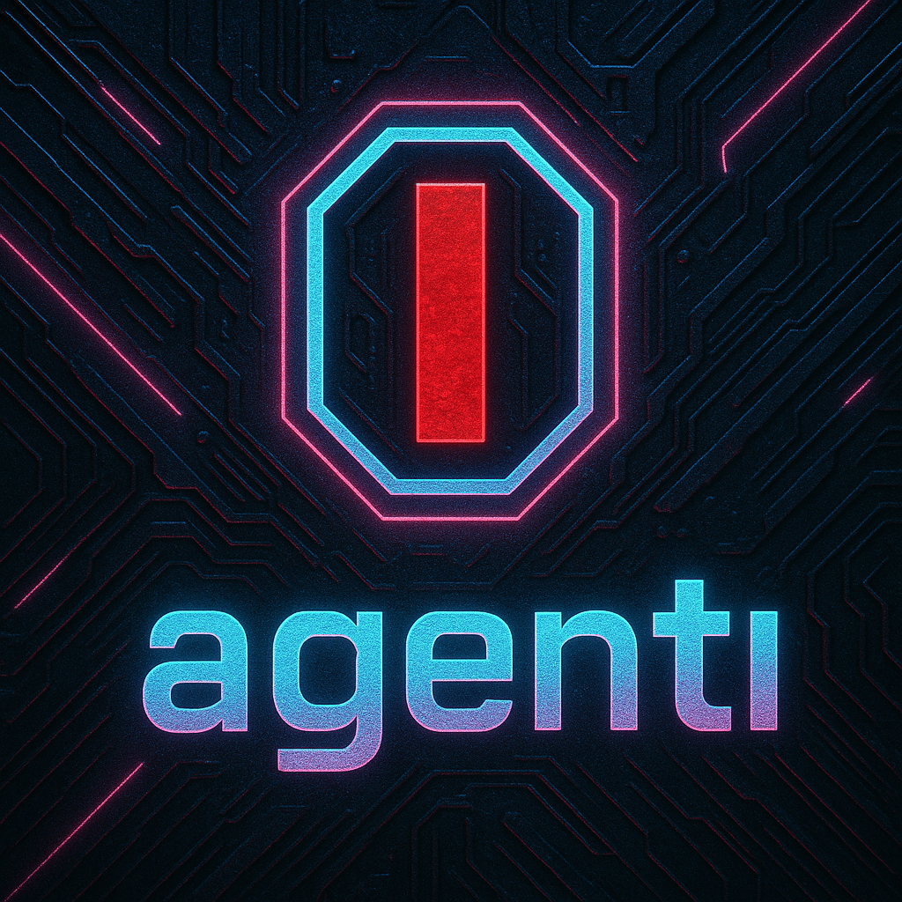

[](LICENSE)
[]()
[](CONTRIBUTING.md)


> 🌟 **你的智能碎片信息管家**  
"随手拍/截图 → 自动识别关键信息（文章/活动/通知）→ 智能提醒+知识归档，告别信息过载🧠载"


## ✨ 为什么选择我们？
- **无感操作**：日常截图/拍照后 → 系统会在后台定期提取信息，无需额外操作
- **智能提醒**：根据事件类型自动触发通知  
- **信息扩展**：根据图像内容，自动进行相应的扩展（如根据文章标题搜索全文提炼摘要）
- **知识储备**：无缝链接个人知识库，简单的方式完成知识积累  

## 🌟 场景示例？  
| 用户场景 | 传统方式 | AgentI 方案 |  
|----------|----------|-------------|  
| 学术材料阅读 | 手动搜索/归档 | 拍照/截图 → 自动提取标题/摘要 → 提醒阅读 |  
| 活动安排 | 日历手动输入 | 海报拍照/截图 → 自动识别时间/地点 → 同步提醒 |  


## 安装
1. 环境要求：python3.12
2. 克隆此仓库：
   ```bash
   git clone  https://github.com/yourname/AgentI.git
   ```
3. 安装依赖项：
   ```bash
   pip install -r requirement.txt
   ```

## 配置

此项目采用一个灵活的配置系统，结合了用于模型设置的 `config.yaml` 文件和用于敏感凭证的 `.env` 文件。

1.  **配置模型 (`config.yaml`)**：
    *   导航到 `config` 目录。
    *   将 `config.example.yaml` 复制为 `config.yaml`。
    *   打开 `config.yaml` 进行自定义：
        *   `active_models`: 指定要使用的默认 `llm` 和 `vlm`。
        *   `llms` / `vlms`: 为每个可用模型定义属性，包括其 `model_name`、`api_base_url`（如果适用）以及 `api_key_name`。`api_key_name` 告诉应用程序在 `.env` 文件中查找哪个变量作为 API 密钥。
        *   `database_tables`: 将分类工具识别的类别映射到数据库中的特定表名。

2.  **配置凭证 (`.env`)**：
    *   在项目根目录下，将 `.env.example` 复制为 `.env`。
    *   打开 `.env` 文件并添加您的 API 密钥和数据库连接信息。变量名（例如 `DEEPSEEK_API_KEY`）必须与您在 `config.yaml` 中为相应模型指定的 `api_key_name` 值相匹配。

## 用法

```bash
python main.py
```

## 🏗️ 开发计划
### **✔️ 已实现基础算法**  
- 本地图片信息提取 → 网页搜索 → SQLite 存储
- 
### **🎯 短期目标**  
**核心功能**  
1. 手机端集成  
   - 相册访问 & 拍照调用
   - 调用ai分析模块  
   - 本地化存储 + 智能提醒
   - 
### **🚀 长期愿景** 
- 场景扩展（美食，旅游）
- 存储信息的个性化处理（例如用户自主控制触发提醒条件）
- 支持用户与存储信息的交互和反馈，以改进智能体处理策略
- 欢迎您的建议

## 👥 贡献者招募
我们特别需要以下帮助：
- **app开发大佬**：在手机端app开发，需要访问手机信息，本地存储，以及触发通知
- **网络安全大佬**：app在获取个人信息分析过程中的信息安全问题
- **UI大佬**：优化交互界面和交互方式设计
- **AI大佬**：扩展更多应用场景，以及提高模型的准确率和速度 

其他方向也欢迎！来看看 [贡献指南](CONTRIBUTING.md) 或直接开 Issue 讨论你的想法~
